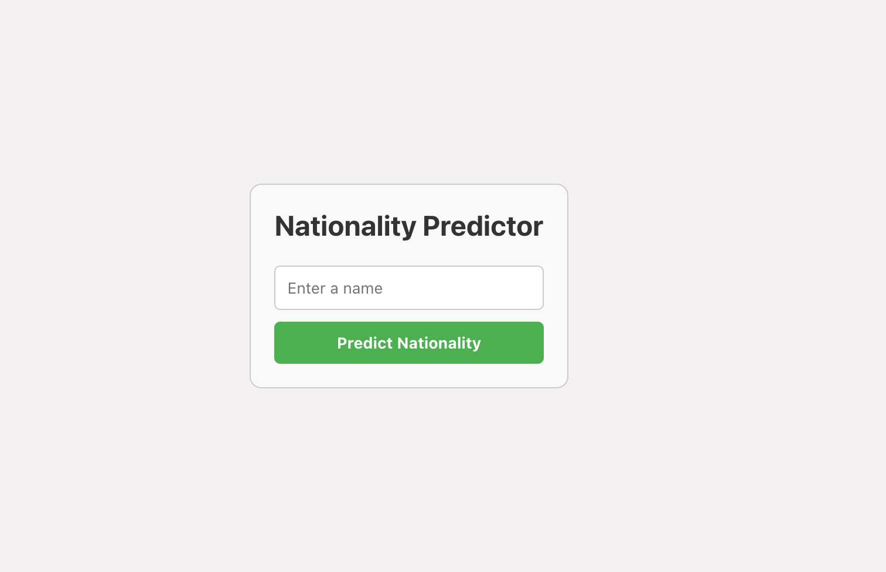

# Nationality Predictor

Nationality Predictor is a simple React web application that predicts the nationality of a person based on their name using the nationalize.io API.

## Features

- Auto-focused input field for entering a name
- Fetch nationality data from the Nationalize.io API
- Display the country ID and probability of the top nationality prediction

## Demo

[View Demo](https://name-nationality-predictor.vercel.app/)

## Technologies Used

- React
- JavaScript
- HTML
- CSS
- nationalize.io API

## Getting Started

To run this project locally, follow these steps:

1. Clone this repository `https://github.com/Damilordz/name-nationality-predictor.git`.
2. Navigate to the project directory.
3. Install dependencies with `npm install`.
4. Start the development server with `npm start`.

## How to Use

1. Enter a name in the input field.
2. Click on the "Predict Nationality" button.
3. View the predicted nationality, country code, and probability.

## Contributing

Contributions are welcome! If you have any ideas for improvements or find any issues, please open an issue or submit a pull request.

## Acknowledgements

- This project uses the [nationalize.io](https://nationalize.io/) API for nationality prediction.

